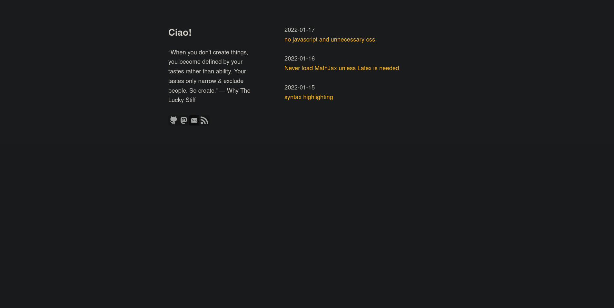
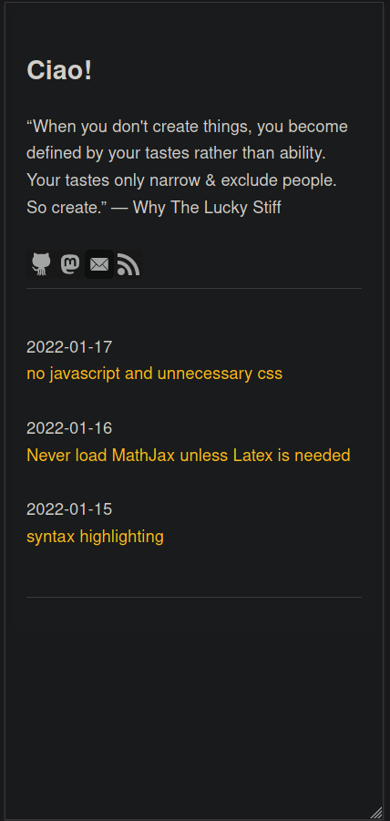

# nodep

A [zola](https://www.getzola.org/) theme with no javascript and unnecessary css dependency at all.

## Usage

1. Download [zola](https://www.getzola.org/documentation/getting-started/installation/)
2. Fork this repo and change repo's name
3. clone your repo
4. cd <repo> && run `zola serve`
5. change anything you want in `config.toml` and git push. If your repo's name is <yourgithubname.github.io>, then `base_url = https://<yourgithubname>.github.io/`, else `https://<yourgithubname>.github.io/<reponame>`
6. In *repo* **settings-Pages**, choose source `gh-pages`. Wait a minute and check `yourgithubname.github.io` or `yourgithubname.github.io/reponame`

## Feature

### No unnecessary dependency

On the basis of great work of [simple.css](https://github.com/kevquirk/simple.css) and [Nicole White](https://github.com/nicolewhite/nicolewhite.github.io_old), only 10KB css file is needed (2.91KB transfered if you minify it ), no jQuery or Bootstrap at all.

* one html (1.46KB transfered / 1.86KB size)
* one css (3.91KB transfered / 10.42KB size)
* **optional** GitHub/mail/rss icons
* **optional** favicon

In my personal [blog](https://tsai002.github.io), I make these svgs and favicon inlined to html so that only two requests required:

* one html(6 icons included) (5.97KB transfered / 10.05KB size)
* one css (2.91KB transfered / 7.08KB size)

Zola is able to minify html and I minified css manually.

### Beautiful

Thanks [simple.css](https://github.com/kevquirk/simple.css)

